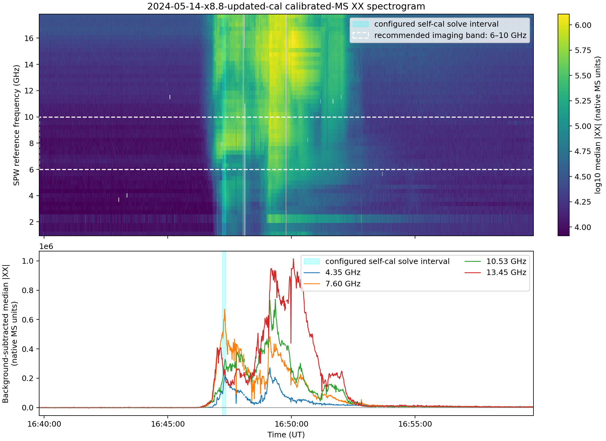
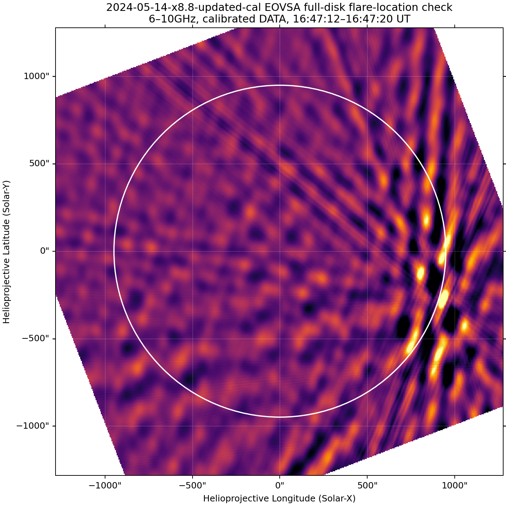
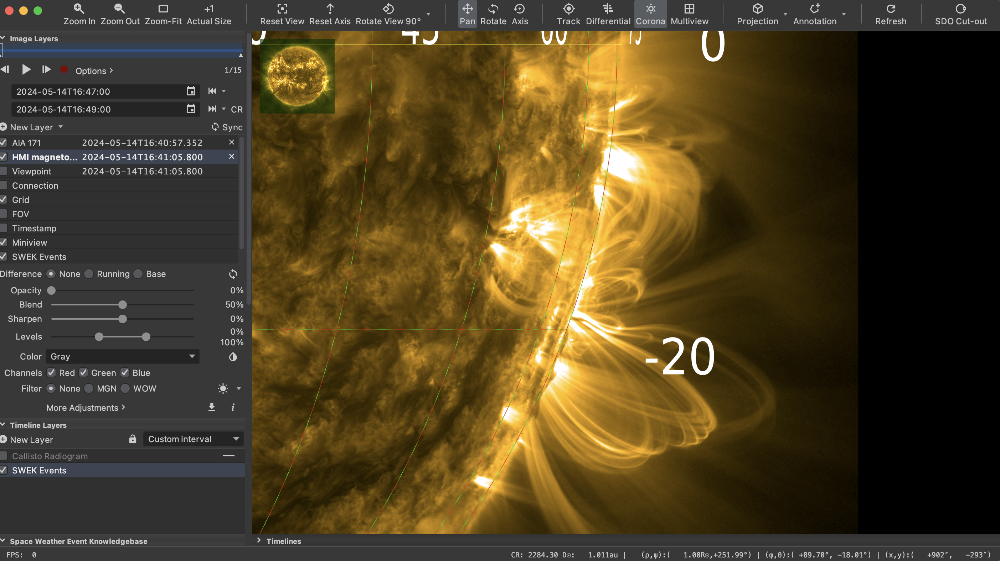

# EOVSA flare self-calibration with modern CASA and `iclean`

This repository is a guided, reproducible update of Bin Chen's 2023
`eovsa_flare_slfcal_example.py`. It preserves the calibration logic—grouped
masks, per-SPW models, iterative gain solving, gain-table inspection, and
before/after imaging—while replacing deprecated `tclean(interactive=True)` with
CASA's browser-based `iclean`.

The worked example is the **2024-05-14 X8.8 flare**. To use another event,
copy the example configuration and make the event decisions listed below.

## Start here

Follow the numbered [run order](#run-order) from a normal macOS Terminal. Do
not start in Jupyter or IPython: `iclean` opens its own browser application and
the Terminal process must remain alive.

Repository guides:

- [Exact `iclean` clicks](docs/iclean-mask-click-guide.md)
- [Worked-event decisions and limitations](docs/EVENT_2024-05-14.md)
- [Experimental 2020-12-07 C7.4 case study](docs/EVENT_2020-12-07.md)
- [Generated product tree](docs/PRODUCTS.md)
- [CARTA and macOS figure viewing](docs/VIEWING.md)
- [Selected example gallery](examples/2024-05-14-x8.8/README.md)
- [Updated-calibration rerun](docs/UPDATED_CALIBRATION_RERUN.md)
- [Preliminary GitHub upload](docs/GITHUB_UPLOAD.md)

## What to download

You need:

1. This repository.
2. One **calibrated, concatenated EOVSA CASA Measurement Set** covering the
   flare. The example filename is
   `IDB20240514_163948-165948.cal.ms`.
3. CARTA for detailed image inspection. Preview is sufficient for PNGs.
4. Internet access only for the optional AIA/GOES tutorial-summary products.

The self-cal scripts do **not** turn raw IDB files into a calibrated MS. Raw
IDB import requires EOVSAPY/SunCASA and calibration-database access; perform
that upstream on the EOVSA pipeline or obtain the calibrated MS from the group.
Do not put the MS inside this Git repository.

## Supported software

The primary solver is designed for an Apple-silicon Mac running native
`arm64` Python 3.12:

| Job | Environment | Required software |
|---|---|---|
| Preflight, survey, `iclean`, gain solving, QA | project `.venv`, native `arm64` | Python 3.12, CASA >=6.7.2, `cubevis==1.0.14` |
| Optional SunCASA tutorial imaging | separate existing x86_64/Rosetta environment | CASA 6.6.x, SunCASA 1.0.8.2 |
| Image inspection | macOS application | CARTA |

Check the Terminal architecture before setup:

```bash
uname -m
```

It must print `arm64` for the primary workflow. The older Rosetta environment
is used only where SunCASA is required; it is not used to run `iclean`.

### Modular CASA versus standalone CASA

The primary workflow uses **Modular CASA**: the `casatasks`, `casatools`, and
`casadata` Python packages installed into an ordinary Python environment. It
does **not** use the standalone/monolithic CASA application or its `casa`
executable. Both setup options below install the same Modular CASA packages
and run the same repository scripts.

A standalone CASA download bundles its own Python interpreter and application.
Do not launch the primary workflow inside that application or mix its packages
into the project environment. The optional legacy SunCASA imaging step is kept
in a separate CASA 6.6.x environment because its dependencies differ from the
native CASA 6.7 `iclean` environment.

## Create the environment

These steps assume macOS. Open **Terminal** from
**Finder → Applications → Utilities → Terminal**, or press Command-Space,
type `Terminal`, and press Return. Enter commands after the `%` prompt; do not
type the prompt itself.

### Download the repository

Choose one method:

1. On GitHub, select **Code → Download ZIP**, double-click the downloaded ZIP,
   and move the resulting folder somewhere permanent; or
2. if Git is installed, clone it in Terminal:

```bash
cd ~/Downloads
git clone https://github.com/mal-wickline/eovsa_selfcal_and_imaging_tutorial.git
```

Enter the repository directory. If its name differs, substitute its real path:

```bash
cd ~/Downloads/eovsa_selfcal_and_imaging_tutorial
pwd
ls
```

`pwd` should show the repository, and `ls` should include `README.md`,
`setup_macos.sh`, `scripts`, and `config`. Keep this Terminal open while
`iclean` is running; the browser window is only the graphical front end.

### Option A: Python virtual environment (`.venv`, recommended)

This is the setup used for the worked 2024 event. From the repository root:

```bash
chmod +x setup_macos.sh
./setup_macos.sh
source .venv/bin/activate
python -c 'import platform, casatasks; from importlib.metadata import version; print("architecture:", platform.machine()); print("CASA:", casatasks.version()); print("CubeVis:", version("cubevis"))'
```

Expected architecture: `arm64`. The setup is project-local and does not modify
old CASA or SunCASA environments. A successful activation normally adds
`(.venv)` to the Terminal prompt. In each new Terminal, return to the
repository and run `source .venv/bin/activate` again before using the scripts.

### Option B: Conda environment

Users who prefer Conda can create an isolated environment with the same
Python version and Modular CASA packages. Install a native Apple-silicon
Miniforge, Miniconda, or Anaconda distribution first, then open a new Terminal
and run these commands from the repository root:

```bash
uname -m
conda create --name eovsa-selfcal python=3.12 pip -y
conda activate eovsa-selfcal
python -m pip install --upgrade pip setuptools wheel
python -m pip install "casatasks>=6.7.2" "casatools>=6.7.2" \
  "cubevis==1.0.14" "bokeh>=3.8" matplotlib astropy numpy
python -c 'import platform, casatasks; from importlib.metadata import version; print("architecture:", platform.machine()); print("CASA:", casatasks.version()); print("CubeVis:", version("cubevis"))'
```

The first command must print `arm64`. A successful activation normally adds
`(eovsa-selfcal)` to the prompt. In each new Terminal, run
`conda activate eovsa-selfcal`; do not also activate `.venv`. All later
commands are identical for both environment options.

If `conda activate` says that the shell is not initialized, run
`conda init zsh`, close Terminal, open it again, and retry. If `python` reports
`x86_64`, stop and install/use a native Apple-silicon Conda distribution.

### Confirm the scripts are ready

From the repository root, with exactly one environment activated:

```bash
which python
python -m py_compile scripts/preflight.py scripts/selfcal.py
python scripts/selfcal.py
```

The last command prints usage information; that is expected. Repository
scripts do not need to be double-clicked or copied into CASA. Run them from
Terminal with `python scripts/<script-name>.py ...`, as shown below.

## Select the peak interval and confirm the flare location

Do this **before** the preflight survey or any gain solve. It follows the EOVSA
guide to [making quick-look flare spectrograms and images](https://ovsa.njit.edu/docs/pages/making-quick-look-flare-spectrograms-and-images/),
using the calibrated Measurement Set named by the event configuration. The
diagnostic is read-only with respect to the input MS.

The reusable implementation is
[`scripts/event_overview.py`](scripts/event_overview.py). Run it with the same
CASA/SunCASA Python that imports `casatasks`, `sunpy`, and `suncasa`.

### 1. Plot the spectrum and choose the peak interval

Copy and edit the updated-calibration example first so that `input_ms` points
to your local MS:

```bash
cp config/2024-05-14-x8.8-updated-cal.example.json \
   config/2024-05-14-x8.8-updated-cal.json

conda activate eovsa-selfcal       # or activate the working .venv
python -c 'import casatasks, suncasa, sunpy; print("overview environment OK")'
python scripts/event_overview.py \
  config/2024-05-14-x8.8-updated-cal.json --spectrogram-only
```

The top panel is a dynamic spectrum from every SPW in calibrated `DATA`. The
script rejects auto-correlations, CASA-flagged samples, and literal zero
placeholders. The lower panel shows representative background-subtracted
frequency light curves, similar to the official EOVSA example. The cyan band
marks the proposed short self-calibration interval.

Choose a bright, compact, structurally stable interval rather than blindly
using the absolute maximum. It must provide enough signal-to-noise without
covering substantial source evolution. Save it as `timerange` in the event
JSON, rerun the plot, and verify that the cyan band covers the intended
feature.

The dashed horizontal box recommends a contiguous 4 GHz imaging band centered
on the largest background-subtracted enhancement between 2 and 16 GHz. Always
inspect the light curves before accepting it; RFI can require a manual
override. For the worked 2024 interval (`16:47:12–16:47:20 UT`), the measured
enhancement peaks near 8 GHz, giving a **6–10 GHz** localization band.



### 2. Make a full-disk radio image and draw the solar limb

After selecting the time and frequency range, run:

```bash
python scripts/event_overview.py \
  config/2024-05-14-x8.8-updated-cal.json \
  --full-disk-only --full-disk-frequency "6~10GHz"
```

The argument is a **frequency selection**, not an SPW range. For another event, choose a contiguous
four to six GHz range around its observed spectral peak (for example, use
`4~8GHz` when the flare peaks between 4 and 8 GHz). You can use your generated spectogram or check the EOVSA wiki / EOVSA data browser flare list to inform your selection --> https://ovsa.njit.edu/flarelist/

The diagnostic combines that band with MFS, images a 2560-arcsec field,
registers the CASA image into helioprojective coordinates, and draws the solar
limb with SunPy. Its internal non-interactive `tclean` is only a
**pre-self-calibration location check** from the official recipe; it does not
replace the interactive `iclean` masking used by this repository's science
pipeline.



Run both products together, allowing the spectrum to select the default 4 GHz
band, by omitting the mode flags:

```bash
python scripts/event_overview.py \
  config/2024-05-14-x8.8-updated-cal.json
```

The purpose is localization, not publication-quality deconvolution. Inspect
the entire disk so a different active region is not mistaken for the target.
In the worked image, the compact radio source is just inside the west limb near
`(Solar X, Solar Y) ≈ (+902″, −293″)`.

### 3. Confirm the location in JHelioviewer

Open AIA 171 Å in JHelioviewer at the selected radio time, enable the grid, and
move the cursor over the flaring structure identified by the full-disk radio
map. Record the **helioprojective Cartesian** `(x, y)` readout in arcseconds
from the lower-right status bar—not the heliographic longitude and latitude.

The worked-event screenshot reads `(x, y) = (+902″, −293″)`, so the event JSON
contains:

```json
"xycen_arcsec": [902.0, -293.0]
```



Finally derive `phasecenter` from the confirmed coordinates with
`scripts/derive_phasecenter.py`. Do not start self-calibration until the radio
source, AIA flare, `xycen_arcsec`, and J2000 phase center all describe the same
location.
## Create an event configuration

```bash
cp config/2024-05-14-x8.8.example.json config/my-event.json
```

Edit `config/my-event.json`. At minimum, decide and document:

The following is a **format example**, not a universal EOVSA selection. Determine
the valid antennas, correlations, SPWs, coordinates, and time range from the
particular MS, preflight report, event overview, and pre-mask survey.

```json
{
  "input_ms": "/absolute/path/to/IDBYYYYMMDD_HHMM-HHMMXXYY.cal.ms",
  "timerange": "2024/05/14/16:47:12~2024/05/14/16:47:20",
  "correlation": "XX",
  "xycen_arcsec": [902.0, -293.0],
  "phasecenter": "J2000 0.8975568718764093rad 0.3247543505252678rad",
  "antenna": "0~6,8,10~12",
  "antenna_by_spw": {"23~49": "0~5,8,10~12"},
  "refant": "0",
  "selfcal_spws": [3, 4, 5, 6, 7, 8, 9, 10],
  "mask_spw_groups": ["3~6", "7~10"],
  "fov_arcsec": [256.0, 256.0],
  "cell_arcsec": 1.0,
  "imsize": 512,
  "robust": 1.0,
  "uvrange": ">500lambda"
}
```

### Allowed forms and event-dependent choices

| Variable | Accepted input form | EOVSA choices and examples |
|---|---|---|
| `input_ms` | Absolute path in a JSON string | Any calibrated EOVSA CASA Measurement Set readable by the installed CASA version, such as `"/Users/name/data/IDB20240514_163948-165948.cal.ms"`. Do not use a raw IDB file, relative path, or `~`. |
| `timerange` | One CASA time-selection string | Full date/time, such as `"2024/05/14/16:47:12~2024/05/14/16:47:20"`, or same-day times such as `"16:47:12~16:47:20"` when CASA can infer the date. Fractional seconds are allowed. Choose a short, bright, structurally stable interval inside the MS. |
| `correlation` | Correlation string present in the MS | Normally `"XX"` here. CASA permits `"XX,YY"`, but EOVSA data requires `"XX"`. |
| `xycen_arcsec` | Two numbers, `[x, y]` | Helioprojective Solar-X and Solar-Y in arcsec, such as `[902.0, -293.0]`, `[119.0, -422.0]`, or `[0.0, 0.0]` for disk center. Either value may be positive, negative, or zero. |
| `phasecenter` | CASA direction string | Prefer J2000 radians, such as `"J2000 0.8975568718764093rad 0.3247543505252678rad"`, derived from `xycen_arcsec` and the observation time with `derive_phasecenter.py`. CASA can also parse valid J2000 sexagesimal directions. |
| `antenna` | CASA antenna-selection string using zero-based IDs | One ID (`"0"`), a comma list (`"0,1,2,4"`), an inclusive range (`"0~6"`), or a mixture (`"0~2,4,6~8,10~12"`). `""` selects all antennas, but use it only after confirming all are valid. These are CASA IDs, not one-based EOVSA hardware labels. Check EOVSA antenna availability for desired event date. Check 2024 event guide selection for further explanation.|
| `antenna_by_spw` | Object mapping SPW selections to antenna selections | `{}` means no overrides. Examples: `{"23~49": "0~5,8,10~12"}` or `{"1~18": "0~8", "19~31": "0~7"}`. Entries should not overlap, and a mask group must not cross an antenna-selection boundary. There are 50 SPWs for EOVSA; typically only 1 to 30ish clearly show the source in self-cal rounds. >30, the SPW imaging gets tricky. |
| `refant` | Selected CASA antenna ID as a string | `"0"`, `"1"`, or another stable antenna with broad SPW coverage. Choose it from flag and gain QA, not merely its number. Keep refant as an input of `"0"` for EOVSA.|
| `selfcal_spws` | JSON list of integer SPW IDs | Any existing SPWs with recognizable source emission and usable baselines, such as `[3, 4, 5, 6]` or `[1, 2, 3, 4, 7, 8]`. Do not use a quoted CASA range here. Dataset SPW counts vary, so every ID must be verified. |
| `mask_spw_groups` | List of quoted CASA SPW selections | A single SPW (`"3"`) or adjacent inclusive range (`"3~6"`), such as `["1~2", "3~6", "7~11"]`. Group similar morphology and one antenna selection. The browser displays the combined range, not a representative SPW. |
| `fov_arcsec` | Two positive numbers, `[width, height]` | Field of view in arcsec, such as `[256.0, 256.0]` or `[512.0, 384.0]`. Include the source and enough background to identify sidelobes. |
| `cell_arcsec` | Positive number | Pixel scale in arcsec/pixel, commonly `0.5`, `1.0`, `2.0`, or `5.0`. It must adequately sample the synthesized beam. |
| `imsize` | Positive integer | Pixels per image axis, commonly `128`, `256`, `512`, or `1024`. Approximate image width is `imsize * cell_arcsec`; choose these together. |
| `robust` | Number from `-2.0` through `+2.0` | CASA Briggs weighting. Values near `-2` favor resolution, values near `+2` favor sensitivity, and `0` is a compromise. Typical trials are `-0.5`, `0.0`, `0.5`, and `1.0`. |
| `uvrange` | CASA UV-distance string | `""` uses all baselines. Examples: `">500lambda"`, `">1klambda"`, `"0~20klambda"`, or `"1~50klambda"`. A lower cutoff suppresses large-scale solar structure but discards data. `">500lambda"` is the typical input here.|

JSON requires double quotes, allows no comments, and allows no trailing comma.
Validate the edited file with:

```bash
python -m json.tool config/my-event.json >/dev/null
```

Never copy antenna or SPW selections blindly between events. The preflight
report and survey images are the authority.

If `phasecenter` has not been derived, use a working SunCASA environment:

```bash
/path/to/suncasa/python scripts/derive_phasecenter.py config/my-event.json
```

Do not solve gains while `xycen_arcsec` or `phasecenter` is missing.

### Choose the `iclean` controls deliberately

The controls in each combined-group browser govern the exploratory CLEAN used
to draw and assess the mask. They do not select the later gain-calibration mode.

| Control | Accepted values | Meaning and practical choice |
|---|---|---|
| `niter` | Integer `0` or greater | Maximum minor-cycle component iterations. `0` makes only the initial dirty/residual image. Start with `100`; increase gradually only while real masked emission remains. Very large values can clean noise or sidelobes. |
| `cycleniter` | Positive integer, or `-1` for no per-cycle limit | Minor-cycle iterations before returning to a major cycle. `25` gives cautious, frequent feedback. A larger value is faster but provides fewer inspection points. |
| `nmajor` | Positive integer, `0`, or `-1` | Maximum major cycles. A major cycle predicts and subtracts the model using the full visibility calculation. `-1` lets another stopping condition or the user stop the run. |
| `threshold` | Non-negative absolute flux-density threshold | Stops when the peak residual reaches this value. `0.0` disables this cutoff. Use a nonzero value only when the image units and noise are understood. |
| `nsigma` | Non-negative number | Residual-RMS stopping multiplier. `0.0` disables it. `3.0`–`5.0` may help with a reliable noise estimate, but structured solar emission and sidelobes can make it misleading. |
| `gain` | Number greater than `0`, normally at most `1` | CLEAN loop gain: the fraction of a component removed per minor iteration. `0.05` is conservative for these EOVSA masks. This is not an antenna gain solution. |
| `cyclefactor` | Positive number | Multiplies CASA's minor-to-major-cycle threshold. `1.0` is the neutral starting choice. Change it only for a diagnosed cycle-control problem. |

Recommended first pass:

```text
nmajor = -1
niter = 100
cycleniter = 25
threshold = 0.0
nsigma = 0.0
gain = 0.05
cyclefactor = 1.0
```

Run one cycle, inspect the image and residual, revise the mask if needed, and
stop once it encloses the connected source without detached sidelobes. If the
source is not distinguishable, do not compensate only by increasing `niter`;
revisit the grouping, antennas, phase center, UV cutoff, field of view, or time.

After all masks are saved, the Terminal asks for `Model-image iterations`.
That separate value controls the non-interactive model supplied to `gaincal`.
Begin with `100`, then inspect the model, residual, gain coverage, and all-SPW
montage before accepting the table. Increase it only if genuine source flux is
unmodeled; reduce it if sidelobes or noise enter the model. Phase is measured in
degrees rather than “centering around 1”; phase-only gain amplitudes stay at 1.

## Run order

All commands below start in the repository root.

### 1. Activate and preflight

```bash
source .venv/bin/activate
python scripts/preflight.py config/my-event.json
```

Read `preflight/<event_id>.txt`. Confirm:

- the MS exists and contains the expected number of SPWs;
- CASA antenna ID-to-name mapping;
- available polarization products;
- flagged fraction for every intended antenna;
- configured timerange, source location, reference antenna, and SPWs.

Stop and edit the configuration if these disagree with the event log.

### 2. Run the smoke test

The smoke test checks CASA, the browser, masking, gain solving, and output
creation using one representative SPW. It is an engineering test, not science.

Create a small config from your event config with one strong SPW, one mask
group, and `max_rounds: 1`, or use the supplied example smoke config after
fixing its `input_ms` path:

```bash
cp config/2024-05-14-x8.8-smoke-test.example.json config/my-event-smoke.json
# Edit input_ms, timerange, position, antenna selection, and representative SPW.
python scripts/selfcal.py run config/my-event-smoke.json
```

Smoke-test checklist:

- [ ] `iclean` opens in a browser.
- [ ] The source is inside the image and at the expected solar location.
- [ ] A compact mask can be added and saved.
- [ ] One 25-iteration test cycle completes.
- [ ] A phase table is written for the representative SPW.
- [ ] `gains_phase.png`, `gain_summary.csv`, and an SPW image are created.
- [ ] The test can be accepted and exits cleanly.

If this fails, do not start the multi-SPW science run.

### 3. Make the pre-mask SPW survey

```bash
python scripts/selfcal.py survey config/my-event.json
```

The command prints a new timestamped run directory. Open its survey montage:

```bash
RUN_DIR="runs/<event-id-and-timestamp>"
open "$RUN_DIR/qa/round_00/images/all_spws.png"
```

Use the montage to remove unusable SPWs and group adjacent SPWs with similar
source morphology. Update `selfcal_spws` and the event-dependent
`mask_spw_groups` in the configuration. The browser displays the complete
configured SPW range for each group, not a representative SPW.

### 4. Run visibility-domain diagnostics

```bash
python scripts/visibility_qa.py config/my-event.json \
  "$RUN_DIR/qa/visibility_input"
open "$RUN_DIR/qa/visibility_input"
```

Inspect amplitude and phase versus frequency by antenna, amplitude versus UV
distance, phase versus time, flags/weights, and baseline-class amplitudes.
These plots justify antenna selection; they do not modify the MS.

### 5. Run the guided self-calibration

```bash
python scripts/selfcal.py run config/my-event.json
```

This command creates a **new** timestamped run and performs the authoritative
masking. Record the new path printed by the script as `RUN_DIR`.

For each mask group, follow the [exact click guide](docs/iclean-mask-click-guide.md).
For the 2024 example, use `niter=100`, `cycleniter=25`, `gain=0.05`, and one
assessment cycle. Draw only around connected source emission, not sidelobes.

At each solve prompt:

- enter `p` for a phase-only round;
- enter the model iterations (the example used 100 for round 1 and 50 for
  round 2);
- wait for all configured SPWs to solve and for QA to finish;
- inspect the checklist below before entering `a`, `c`, or `r`.

Prompt meanings:

- `a`: accept this table and finish;
- `c`: accept this table and continue to another round;
- `r`: reject this candidate and stop, restoring previously accepted tables.

Amplitude (`a`) or amplitude-plus-phase (`ap`) remains available because it
was present in Bin's procedure, but it is optional and was not needed for the
worked X8.8 event. Never add amplitude self-cal automatically.

### 6. Accept or reject each round

Open the current QA directory:

```bash
open "$RUN_DIR/qa/round_01"
open "$RUN_DIR/qa/round_01/images/all_spws.png"
open "$RUN_DIR/qa/round_01/gains_phase.png"
open "$RUN_DIR/qa/round_01/gain_summary.csv"
```

Round acceptance checklist:

- [ ] Intended antennas have solutions; empty panels match deliberate exclusions.
- [ ] Phase versus SPW is plausible, without unexplained antenna jumps.
- [ ] Amplitudes remain 1.0 for a phase-only table.
- [ ] Flagged/missing solutions are understood.
- [ ] Source morphology improves or remains stable across adjacent SPWs.
- [ ] No new fragmentation, strong sidelobes, centroid jump, or large flux change.
- [ ] The mask contains plausible source emission and excludes noise/sidelobes.
- [ ] The candidate is better than, or has converged relative to, the prior round.

Reject a round if any important failure is unexplained. More rounds are not
automatically better; convergence is a valid stopping condition.

### 7. Inspect the accepted short MS

After acceptance:

```text
$RUN_DIR/final/short_peak.selfcal.ms
```

The input full-duration MS has not been modified. Review the manifest and every
accepted round before applying anything to the full observation.

### 8. Optional tutorial-style before/after imaging

Run this with the separate SunCASA environment, not the native `.venv`:

```bash
CASAPY="/path/to/suncasa/python"
"$CASAPY" scripts/tutorial_imaging.py config/my-event.json "$RUN_DIR"
```

To also make the tutorial-style individual-band cube and color-coded EOVSA
contours over AIA 171, add both flags:

```bash
"$CASAPY" scripts/tutorial_imaging.py config/my-event.json "$RUN_DIR" \
  --tutorial-summary --multiband
```

`final_imaging_spws` controls that cube. It can contain nearly all 50 bands,
but must be edited after inspecting the new MS. Bands outside `selfcal_spws`
are pipeline-calibrated context; they are not silently promoted to
self-calibrated data.

## Repeating the event after an upstream calibration change

Never replace the old input MS or gallery. Follow
[`UPDATED_CALIBRATION_RERUN.md`](docs/UPDATED_CALIBRATION_RERUN.md), use the
`updated-cal` example configuration, and publish the approved new PNGs beside
the previous-calibration gallery. This keeps upstream-calibration changes
separate from self-calibration changes.

To add AIA 171, GOES, disk/grid, flare zoom, and radio contours:

```bash
"$CASAPY" scripts/tutorial_imaging.py config/my-event.json "$RUN_DIR" \
  --frequency-ranges '2~4GHz,5~6GHz,7~8GHz,9~10GHz,10~12GHz' \
  --tutorial-summary
```

The script writes essential radio PNGs before network-dependent AIA/GOES work.
Its MFS pairs are shallow dirty-map diagnostics: diagonal stripes and negative
bowls are synthesized-beam sidelobes, not additional solar sources. Use the
mask-guided per-SPW montages—not dirty MFS panels—to judge round acceptance.

### 9. Apply accepted tables to the full-duration MS

This is intentionally separate and confirmation-gated:

```bash
python scripts/selfcal.py apply-full config/my-event.json "$RUN_DIR"
```

Read the prompt, verify the run path, then type `APPLY`. The script copies the
input MS and writes `final/full_duration.selfcal.ms`; it does not overwrite the
original.

## Viewing figures on macOS and in CARTA

Use Preview/Finder for summary PNGs:

```bash
open "$RUN_DIR/qa/round_00/images/all_spws.png"
open "$RUN_DIR/qa/round_01/images/all_spws.png"
open "$RUN_DIR/qa/round_01/gains_phase.png"
open "$RUN_DIR/qa/tutorial_imaging/tutorial_summary_after_10_to_12.png"
```

Use CARTA for FITS images and WCS-aware inspection:

```bash
open -a CARTA
```

In CARTA choose **File → Open**, then open, for example,
`$RUN_DIR/qa/round_01/images/spw_18.fits`. Compare the same SPW from
`round_00`, `round_01`, and `round_02`; match spatial coordinates and color
limits before judging improvement. See [docs/VIEWING.md](docs/VIEWING.md) for
the complete procedure and recommended files.

## Decisions used for the worked event

The 2024-05-14 example used:

- solve interval `16:47:12–16:47:20 UT`;
- HPC center `(x,y)=(+902,-293)` arcsec;
- `XX`, SPWs 3–31, and mask groups `3~6`, `7~14`, `15~22`, `23~31`;
- CASA antennas `0~6,8,10~12`, with CASA 6 removed at SPW 23 and above;
- reference antenna 0 and `uvrange='>500lambda'`;
- two accepted phase-only rounds and no amplitude solve.

These choices and their evidence are documented in
[docs/EVENT_2024-05-14.md](docs/EVENT_2024-05-14.md). They are not universal
defaults.

## Experimental 2020-12-07 event workflow

The repository also includes a separate C7.4 case study for testing the same
scientific procedure on an older, 50-SPW observation. It is intentionally kept
apart from the main worked example:

- the **2024 configuration and `scripts/selfcal.py` remain the primary,
  published workflow**;
- `config/2020-12-07-c7.4.example.json` records the 2020 event decisions; and
- `scripts/selfcal_2020_iclean.py` contains only the event-specific CASA 6.7
  adjustments needed by that MS while retaining interactive `iclean`.

See [docs/EVENT_2020-12-07.md](docs/EVENT_2020-12-07.md) for the decisions,
commands, accepted procedure, and current limitations. Its AIA grayscale and
multiband contour figures are preliminary and are not yet publication-ready.

## Known quirks and safeguards

- `cubevis` 1.0.14 has an imagename lookup issue; `selfcal.py` works around it
  by running each mask in its own directory with a basename.
- Reusing stale CASA image products can cause spectral-coordinate mismatch
  errors. Every run uses a new timestamped directory; do not copy old mask
  working products into it.
- SunCASA's default JP2 AIA download was unreadable in the tested x86 build;
  `tutorial_imaging.py` downloads and validates a FITS through SunPy/Fido.
- This MS contains unflagged literal zero placeholders. The spectrum helper
  removes nonpositive samples before taking its median.
- SunCASA mishandles paths containing spaces during image registration. The
  wrapper uses a space-free temporary directory and copies completed FITS back.
- EOVSA has multiple antenna diameters, so CASA may warn that the primary beam
  could be wrong. This compact limb-source workflow does not treat the warning
  as proof that a solution is valid; image and gain QA remain mandatory.
- `minsnr=0` in the worked config is deliberately inclusive. It disables
  formal S/N rejection and therefore requires manual gain-table and image QA.

## Repository contents and data policy

`scripts/` contains the executable workflow; `config/` contains sanitized
examples; `docs/` contains task-specific guides; `examples/` contains selected
derived PNGs. Generated CASA products live under ignored `runs/` directories.

Commit source, Markdown, sanitized configuration, and approved example PNGs.
Do not commit IDBs, Measurement Sets, gain tables, CASA images/masks, FITS,
downloaded AIA data, `.netrc`, passwords, virtual environments, logs, or full
run directories.
