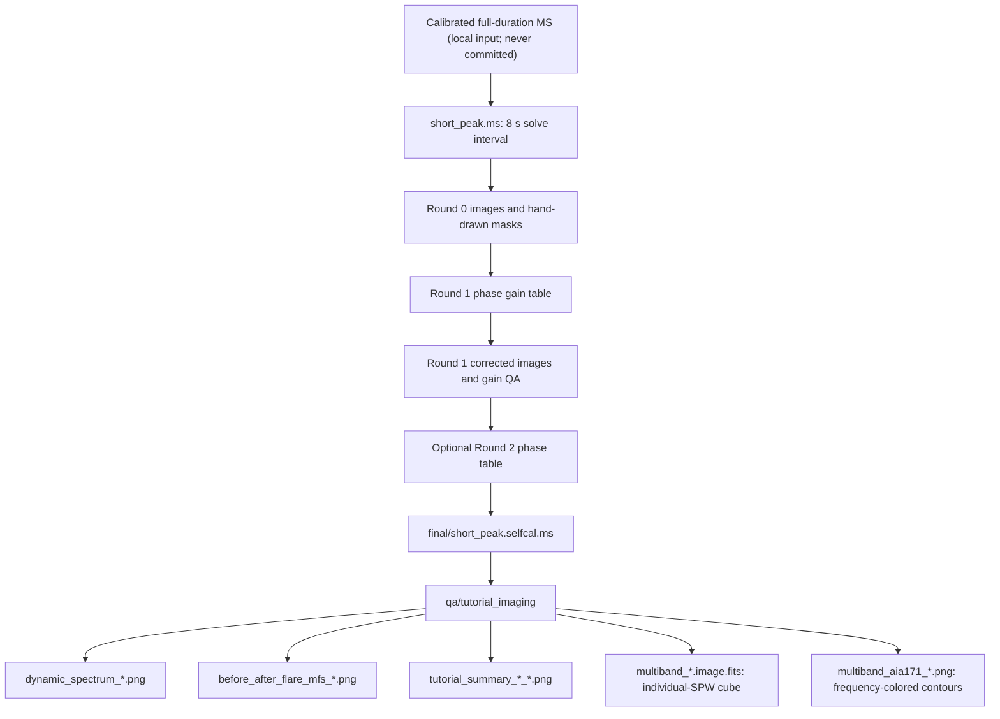

# Output products and interpretation

The repository contains code and documentation. Large CASA products are made
inside `runs/`, which is intentionally ignored by Git.



## Product tree

```text
runs/<event-and-timestamp>/
├── short_peak.ms                         # disposable 8 s working MS
├── masks/                                # CASA masks made with iclean
├── caltables/                            # accepted phase tables by round
├── final/
│   └── short_peak.selfcal.ms             # accepted short self-cal MS
└── qa/
    ├── round_00/images/all_spws.png       # pre-self-cal SPW mosaic
    ├── round_01/
    │   ├── images/all_spws.png            # after first phase solve
    │   ├── gains_phase.png
    │   └── gain_summary.csv
    ├── round_02/                          # same products for round 2
    ├── visibility_input/                  # visibility-domain diagnostics
    └── tutorial_imaging/
        ├── dynamic_spectrum_before.png
        ├── dynamic_spectrum_after.png
        ├── before_after_flare_spw_*.png
        ├── before_after_flare_mfs_*.png   # dirty-map QA, not final restored imaging
        ├── tutorial_summary_before_*.png
        ├── tutorial_summary_after_*.png
        ├── multiband_aia171_before.png
        ├── multiband_aia171_after.png
        ├── multiband_spws.txt             # exact planes requested
        ├── multiband_*.image.fits          # local-only frequency cubes
        └── *.fits / *.ms                  # local-only intermediates
```

## Interpretation boundaries

- `round_00` versus `round_01` is the main demonstration of improvement.
- `round_01` versus `round_02` tests convergence; little change is expected.
- `before_after_flare_mfs_10_to_12.png` is the best high-flux, in-solve
  frequency-range comparison.
- `12_to_14` is context only: the accepted solve ends at SPW 31, about
  11.97 GHz. It must not be described as self-calibrated.
- The dynamic spectrum covers only the 8 s solve interval. It is not a
  replacement for the 15-minute observatory/wiki flare spectrum.
- Tutorial summaries use AIA 171 FITS plus positive 60/75/90% radio contours.
  Earlier black-spectrum or disk-wide-contour summaries are failed development
  products and should not be presented.
- The multi-band overlay follows the official SunCASA tutorial by passing a
  list of individual SPWs. A GHz range such as `10~14GHz` is MFS and cannot
  substitute for this frequency-resolved product.
- `multiband_spws.txt` is the provenance record for the displayed colors.
  SPWs outside `selfcal_spws` are upstream pipeline-calibrated context only.

## What to open and with which application

| Product | Purpose | Open with |
|---|---|---|
| `round_N/images/all_spws.png` | Fast SPW-by-SPW round comparison | Preview (`open FILE`) |
| `round_N/images/spw_XX.fits` | WCS-aware image, matched scale and regions | CARTA |
| `round_N/gains_phase.png` | Phase solution versus SPW by antenna | Preview |
| `round_N/gains_amplitude.png` | Amplitude solution versus SPW | Preview |
| `round_N/gain_summary.csv` | Missing/flagged solution statistics | Numbers, Excel, or text editor |
| `visibility_input/*.png` | Antenna/baseline visibility diagnostics | Preview |
| `tutorial_imaging/*.png` | Spectrum and AIA/radio context summaries | Preview |
| `tutorial_imaging/*.fits` | Matched before/after radio maps | CARTA |
| `manifest.json` | Configuration and accepted-round provenance | Text editor |

See [`VIEWING.md`](VIEWING.md) for the exact macOS and CARTA sequence.

## Git policy

Commit source, configuration, Markdown, and a deliberately selected handful of
small PNG examples. Do not commit measurement sets, CASA images/masks, gain
tables, FITS, downloaded AIA files, runtime environments, logs, or the complete
`runs/` directory.
