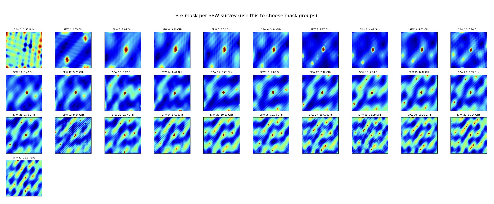
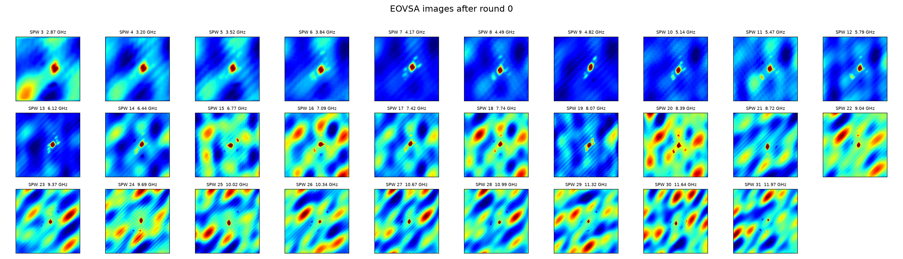
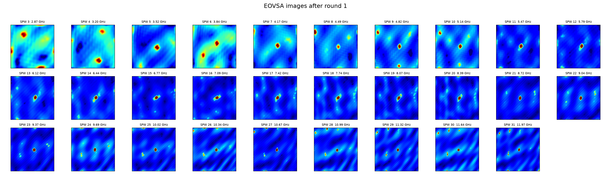
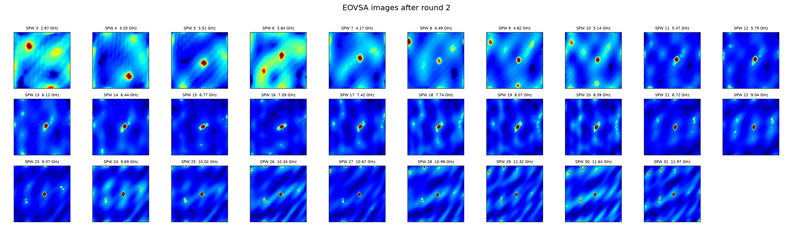
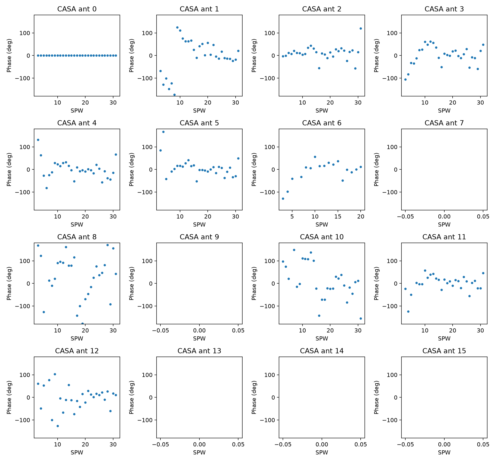
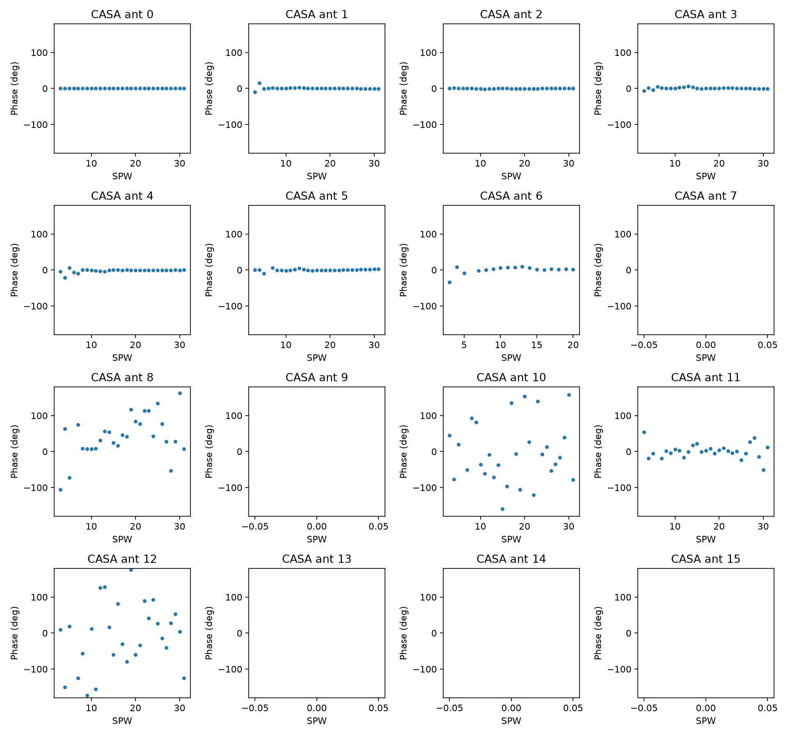
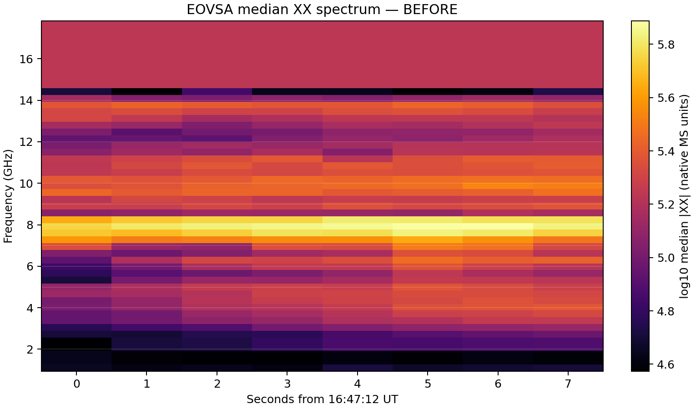
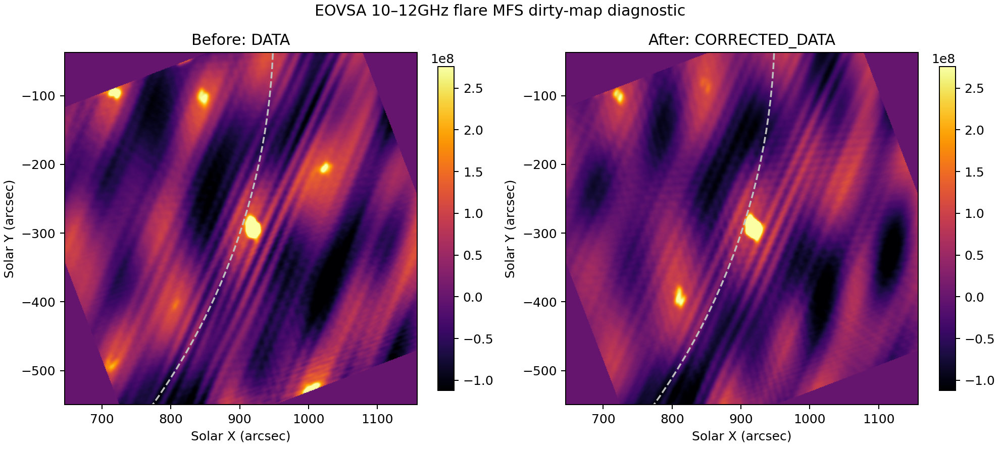
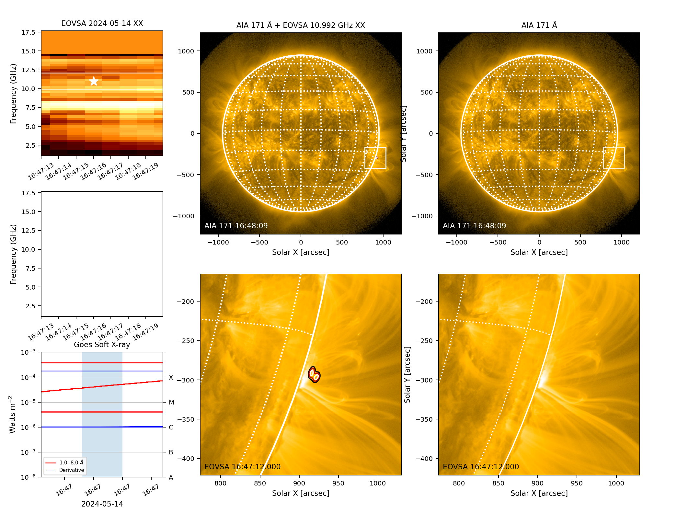

# 2024-05-14 X8.8 calibration comparison gallery

## Mask-making reference

The [illustrated `iclean` mask-making reference](mask-making-reference/README.md) records the pre-mask SPW survey, why SPWs 1–2 were excluded from the self-calibration solve, the browser parameters, and the masks drawn for representative frequency groups.

The folders intentionally preserve two calibration generations:

- [`previous-calibration/`](previous-calibration/) is the accepted baseline
  already shown below.
- [`updated-calibration/`](updated-calibration/) receives only reviewed PNGs
  from the new PI-updated-calibration rerun.

Do not overwrite the baseline files. Keeping both generations lets the group
separate improvement caused by the revised upstream calibration from
improvement caused by each self-cal phase round.

These PNGs are a small review set from the accepted two-round phase-only run.
They are included so the workflow can be reviewed without publishing the raw
IDB files, Measurement Set, CASA images, or gain tables.

- `round_00_all_spws.png`: calibrated input before self-cal.
- `round_01_all_spws.png`: main image improvement after phase round 1.
- `round_02_all_spws.png`: convergence check; little change from round 1.
- `round_01_gains_phase.png` and `round_02_gains_phase.png`: accepted phase
  solutions. Empty panels are antennas deliberately unavailable in this MS.
- `dynamic_spectrum_8s.png`: median positive XX visibility diagnostic for the
  eight-second solve interval. This is not the 15-minute calibrated flare
  spectrum published on the EOVSA wiki.
- `before_after_10_to_12_dirty_diagnostic.png`: same-settings dirty-map QA.
  Diagonal stripes and negative bowls are synthesized-beam sidelobes, not
  additional solar sources or final restored imaging.
- `tutorial_summary_{before,after}_10_to_12.png`: tutorial-style AIA 171
  context with positive 60/75/90 percent radio contours. The similarity is
  expected for a phase-only solve that converged after its first round.

The solve covered SPWs 3--31 (about 2.87--11.97 GHz). Thus 10--12 GHz is the
highest-frequency in-solve comparison. Products above 12 GHz are context only.

## Image progression

### Round 0: calibrated input before self-cal

### Round 1: primary phase-only improvement

### Round 2: convergence check

## Gain solutions

### Round 1

### Round 2

## Spectrum and solar context

### Tutorial-style AIA/radio overlay before self-cal

### Tutorial-style AIA/radio overlay after self-cal

## Updated-calibration results

This section is deliberately empty until the new MS has passed preflight,
self-cal QA, and gallery review. See [`updated-calibration/README.md`](updated-calibration/README.md).
