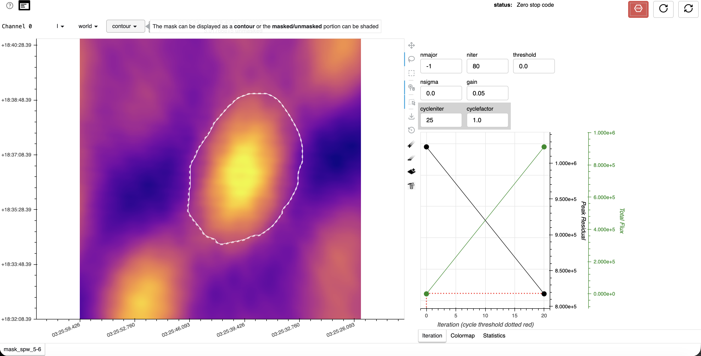
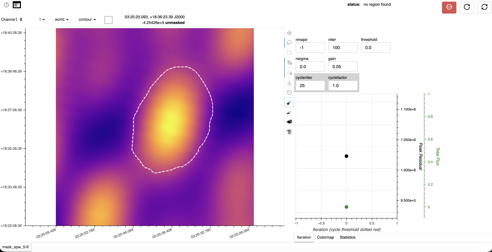
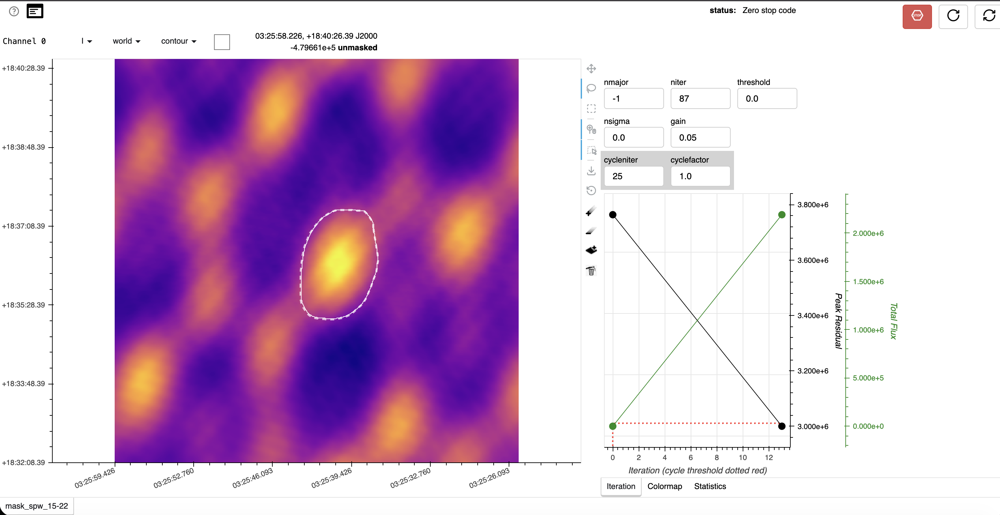
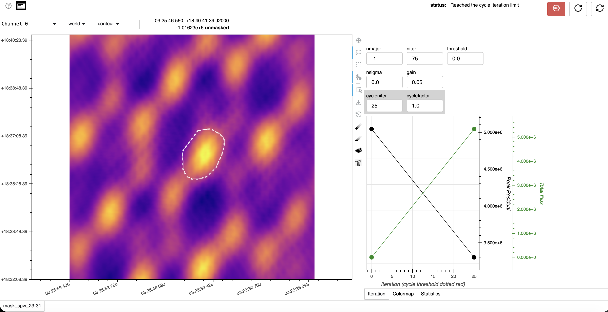

# Illustrated `iclean` mask-making reference

These screenshots document the mask choices for the 2024-05-14 X8.8 example. They are visual references for identifying the compact flare source and drawing a conservative mask; they are not masks to reuse blindly for another event.

For the exact browser controls and click order, see the [full `iclean` click guide](../../../docs/iclean-mask-click-guide.md).

## 1. Inspect every SPW before grouping masks

This survey is the reason the example self-calibration solve begins at SPW 3:

- **SPW 1 (1.58 GHz): reject from the self-cal solve.** The field is dominated by sidelobe-like structure and has no trustworthy compact flare source.
- **SPW 2 (2.55 GHz): reject from the self-cal solve.** It contains competing/displaced peaks and is not sufficiently reliable for the model used here.
- **SPWs 3–31: retain for self-calibration.** The compact source is identifiable, although image quality becomes progressively more sidelobe-dominated at high frequency.
- SPWs 1–2 remain in the original Measurement Set; excluding them from the solve does not delete them.

The configured mask groups are `3~6`, `7~14`, `15~22`, and `23~31`. A representative SPW is imaged for each group, and its mask is used for the group.

## 2. Browser parameters used for this example

| Control | Value |
|---|---:|
| `nmajor` | `-1` |
| `threshold` | `0.0` |
| `nsigma` | `0.0` |
| `gain` | `0.05` |
| `cycleniter` | `25` |
| `cyclefactor` | `1.0` |

The displayed `niter` values below are cumulative inspection checkpoints, not universal targets. Stop when the compact source and mask are clear; do not clean deeply into sidelobes.

## 3. Low-frequency mask example

The following screenshots show the same low-frequency source after two inspection points.

The historical browser label in these screenshots is `mask_spw_5-6`. In the final production configuration, the first solve group is `3~6`, represented by SPW 5. The important feature is the mask geometry around the central compact source, not the old label.

## 4. Middle-frequency mask example

The mask follows the connected central source with a modest buffer. Detached bright sidelobes remain outside it.

## 5. High-frequency mask example

At higher frequencies, the sidelobe field is stronger. Mask only the compact source that remains spatially consistent with the flare; do not expand the mask to include the repeating diagonal peaks.

## Mask acceptance checklist

- The mask encloses the connected flare source and leaves a modest margin.
- Detached or repeating sidelobes are excluded.
- The mask does not touch the image boundary.
- A short clean leaves the model concentrated inside the source mask.
- The saved mask is inspected before starting the gain solve.

