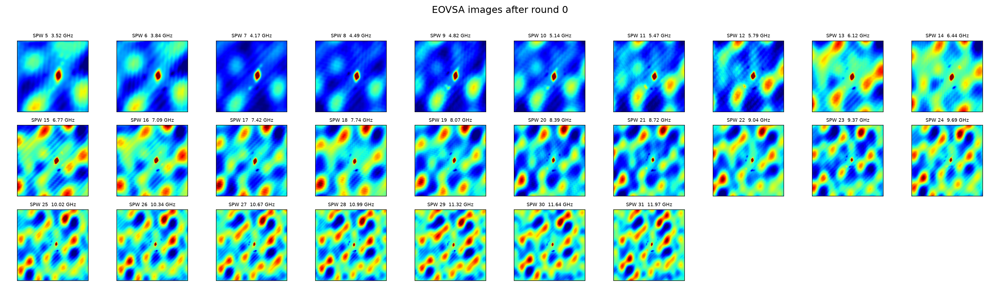
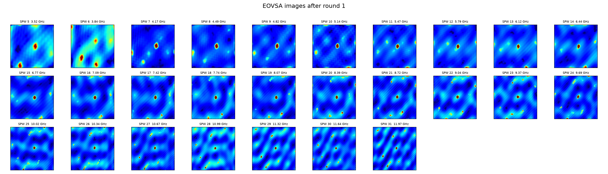
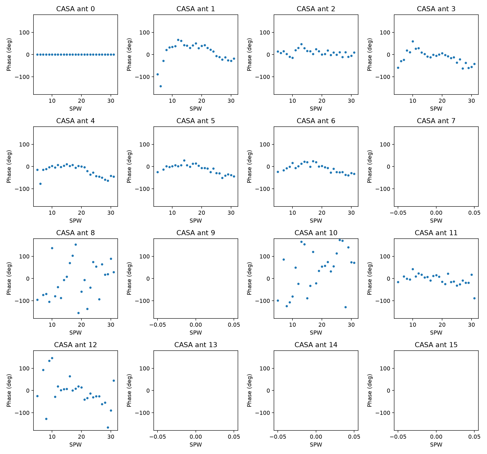
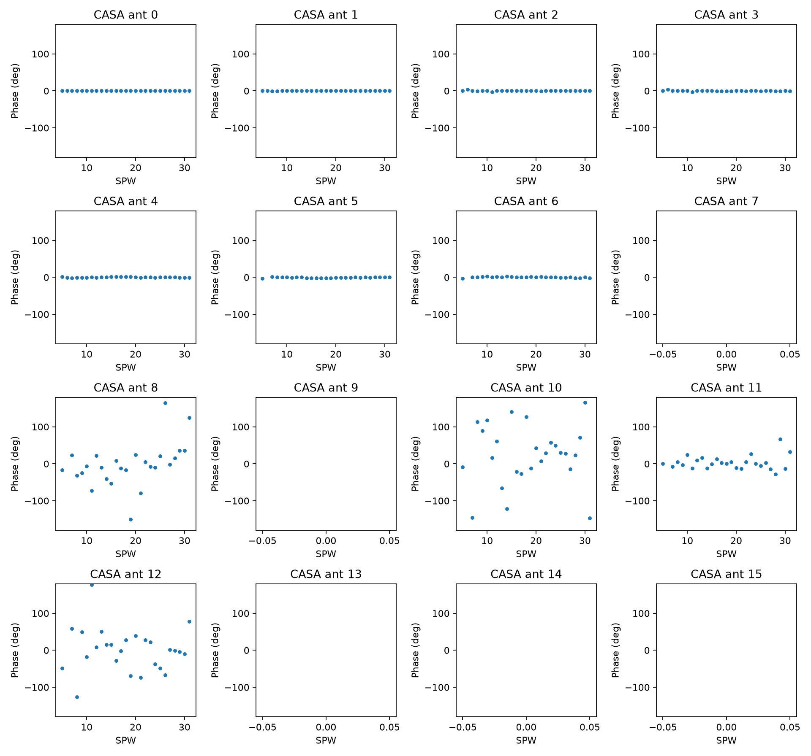
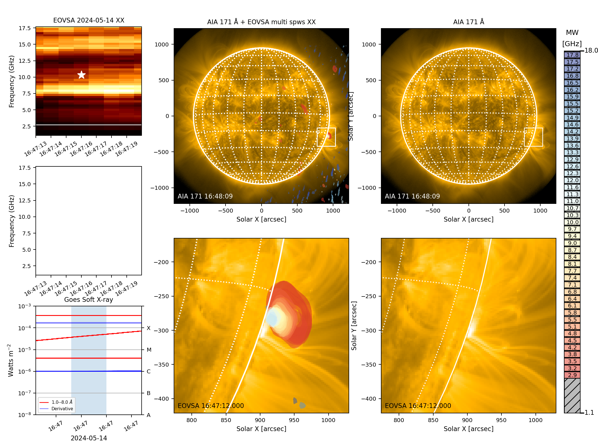
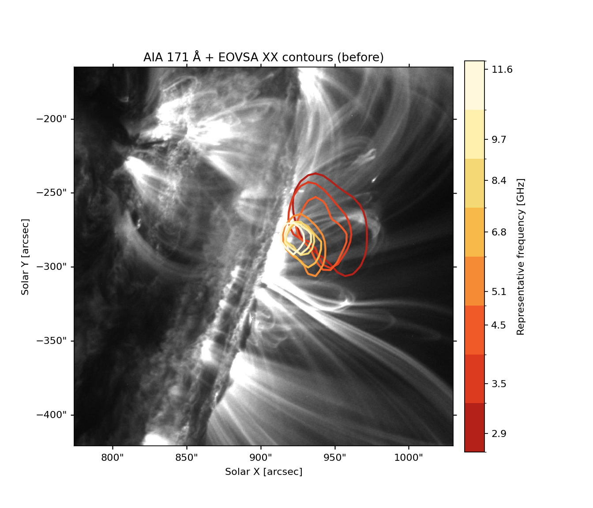
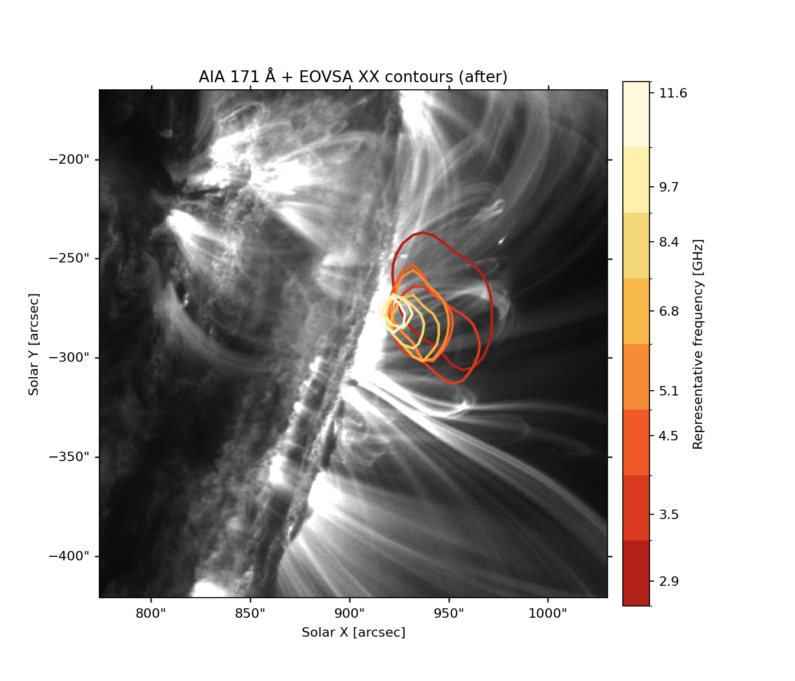
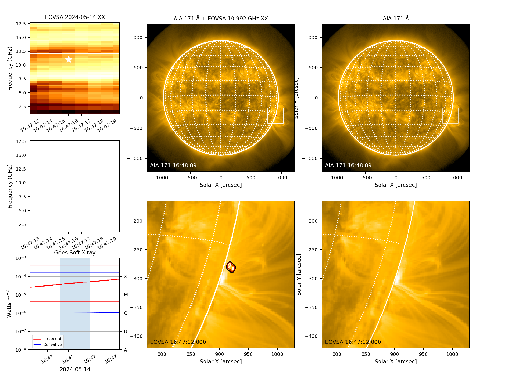

# Updated-calibration gallery

These are reviewed products from the PI-updated calibration MS and its
accepted two-round, phase-only self-calibration run. Measurement Sets, CASA
image directories, FITS cubes, and gain-table directories remain local.

## Image progression

## Accepted phase solutions

The amplitude panels are retained as QA, but the solve remained phase-only;
unity amplitudes are therefore expected.

## All-frequency AIA 171 quicklooks

## Representative-frequency contours

Each figure uses one contour per representative frequency: 2.9, 3.5, 4.5,
5.1, 6.8, 8.4, 9.7, and 11.6 GHz. Both panels use the same sharp AIA 171
background.

## 10--12 GHz tutorial comparison

